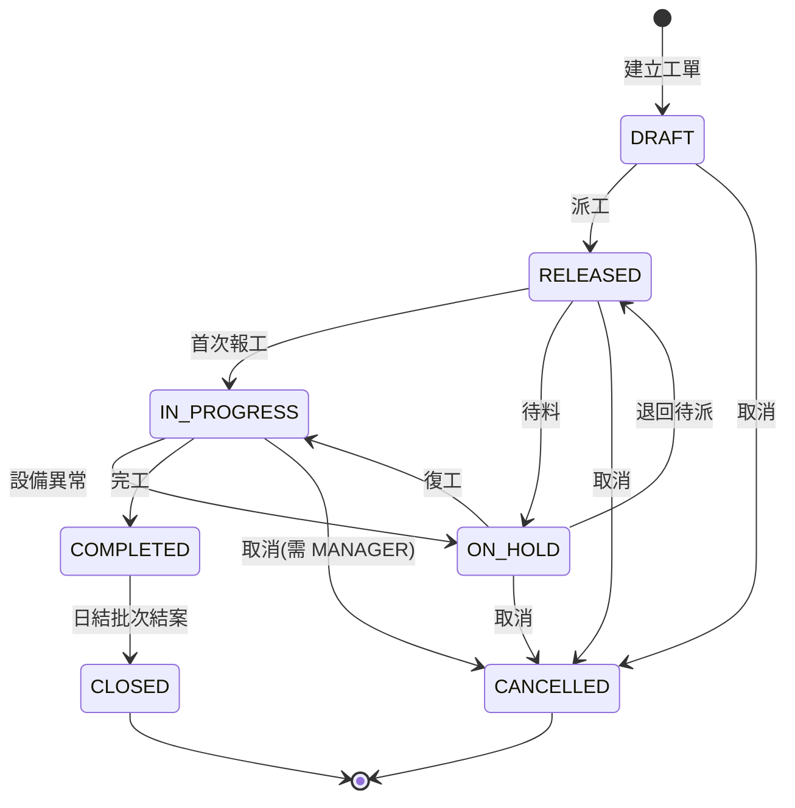

# 工單報工與物料扣帳系統

[](https://github.com/thothawei/mes-workorder/actions/workflows/ci.yml)
[](https://adoptium.net/)
[](https://spring.io/projects/spring-boot)

模擬製造現場從**派工 → 報工 → 依 BOM 扣料 → 完工 → 日結**的完整流程，Java 後端專案。

系統邊界刻意收斂在四件事：工單、報工、物料扣帳、報表。不做採購、不做出貨、不做財務。
因為這個專案想證明的不是「功能很多」，而是一件更難的事：

> **在併發與異常之下，庫存和產出的數字不會錯。**

---

## 三分鐘看完

```bash
git clone https://github.com/thothawei/mes-workorder.git
cd mes-workorder
```

需要 Docker：

```bash
docker compose up -d
```

沒有 Docker 也能跑（記憶體資料庫，Flyway migration 照跑，schema 與正式環境一致）：

```bash
./mvnw spring-boot:run -Dspring-boot.run.profiles=h2
```

兩種方式都不需要先安裝 Maven——專案附 wrapper，也不需要設定任何環境變數或申請任何金鑰。

| 入口 | 位置 |
|---|---|
| **現場報工頁** | http://localhost:8080/ |
| API 文件 | http://localhost:8080/swagger-ui.html |
| 健康檢查 | http://localhost:8080/actuator/health |
| 資料庫（compose 模式） | `localhost:15432`，帳密皆為 `mes` |

> compose 把 PostgreSQL 開在 **15432** 而不是 5432：開發機上通常已經有一個
> PostgreSQL 或別的專案容器佔著 5432，直接用會讓人第一步就撞到 port 衝突。

示範帳號（密碼皆為 `pass1234`）：

| 帳號 | 角色 | 可做的事 |
|---|---|---|
| `operator01` | 現場作業員 | 查工單、報工 |
| `leader01` | 線長 | ＋ 建立工單、派工、暫停、完工 |
| `manager01` | 廠務主管 | ＋ 取消工單、查報表、手動日結 |

種子資料是一張已派工的工單 `WO-20260728-001`（線性滑軌滑座，計畫 60 件），
物料庫存刻意設成**只夠做 50 件**，可以直接跑出庫存不足回滾的行為。

### 用畫面走一遍（推薦）

打開 http://localhost:8080/ ，用 `operator01` 登入，點左邊任一張工單，然後：

1. 按「**送出報工**」→ 綠色訊息顯示累計產出，下方列出這次扣掉哪些料、扣完剩多少，
   左側清單即時變成「生產中」
2. 按「**用同一把鍵再送一次**」→ 變成黃色的「已受理過，未重複計算」，
   而且左側進度**不會翻倍**——這就是冪等鍵在做的事
3. 把良品數改成 `45` 再送 → 紅色訊息「物料 M-SEAL-01 庫存不足：需要 90，可用 80」，
   工單產出維持原樣，證明整筆交易回滾了

這一頁是刻意做成單一 HTML 檔、零外部依賴（沒有 CDN、沒有前端框架）的。
它的任務不是展示前端能力，而是讓人不必開 Swagger 拼 JSON 就能看懂系統在做什麼。

### 走一遍完整流程（curl）

```bash
TOKEN=$(curl -s -X POST localhost:8080/api/v1/auth/login \
  -H 'Content-Type: application/json' \
  -d '{"username":"operator01","password":"pass1234"}' | sed 's/.*"token":"\([^"]*\)".*/\1/')
```

```bash
curl -s -X POST localhost:8080/api/v1/production-reports \
  -H "Authorization: Bearer $TOKEN" -H 'Content-Type: application/json' \
  -d '{"orderNo":"WO-20260728-001","warehouseCode":"WH-RAW","machineCode":"MC-01","goodQty":10,"defectQty":1,"defectReason":"SCRATCH","workMinutes":60,"idempotencyKey":"demo-001"}'
```

把同一行**再送一次**（`idempotencyKey` 不變）——回應會變成 `"duplicated": true`，
而且庫存不會再扣一次。這就是這個專案的核心承諾。

---

## 這個系統怎麼運作

### 工單狀態機

7 個狀態、12 條合法轉換，規則集中在 `WorkOrderTransition` 一張表。
其他程式碼一律透過它判斷，沒有任何地方自己寫 if-else 判斷狀態。



要在完工前插入「品檢」關卡時，改動範圍是：狀態 enum 加一個值、規則表改兩行、加一支 API。
Service 與 Controller 完全不動——這是把規則集中的實際回報。

### 一次報工發生什麼事

全部在**同一個交易**內，全成功或全失敗：

```
POST /api/v1/production-reports
   ↓  @Transactional 邊界
   ├─ 1. 以 idempotencyKey 查既有報工 → 命中就直接回傳，不重跑
   ├─ 2. 悲觀鎖載入工單（SELECT ... FOR UPDATE）
   ├─ 3. workOrder.reportProduction() → Entity 自己檢查狀態與超產上限
   ├─ 4. 依 BOM 展開扣料，庫存不足 → 拋例外
   ├─ 5. 寫入物料異動流水（可回溯到這一筆報工）
   └─ 6. 寫入報工紀錄
   ↓
交易提交；任何一步失敗 → 全部回滾，不留半筆髒資料
```

### 為什麼工單用悲觀鎖、庫存用樂觀鎖

不是隨便選的：

- **工單用悲觀鎖**：同一張工單被多人同時報工是**高機率**事件（輪班交接）。
  樂觀鎖會頻繁衝突重試，不如直接讓它們在資料庫排隊。鎖只在單筆短交易內持有。
- **庫存用樂觀鎖**：同一物料被不同工單搶用是**低機率**事件（物料種類多、需求分散）。
  用悲觀鎖會讓熱門原料的資料列變成全系統瓶頸。

### 三層防重複扣料

| 層 | 機制 | 擋得住什麼 |
|---|---|---|
| 應用層 | `idempotencyKey` 先查一次 | 一般重送（快樂路徑，不耗鎖） |
| **資料庫層** | `idempotency_key` UNIQUE 約束 | **多節點併發重送——真正的防線** |
| 交易層 | 扣帳與報工同一交易 | 中途失敗留下的半套資料 |

第二層才是重點：**應用層的「先查再寫」在多台機器同時跑時一定會漏，只有 DB 約束不會。**

### 一個容易被忽略的設計

重試與冪等回查寫在 `ProductionReportFacade`，**在交易邊界之外**，而不是塞進 Service 裡。
原因是 Spring 交易的硬性限制：交易一旦被標記為 rollback-only，
在同一個交易裡做任何補救都會連帶失敗。

順帶一提，它也不能寫成同一個類別裡的另一個方法——
同類別內的自我呼叫會繞過 Spring AOP proxy，`@Transactional` 根本不會生效。
這個坑單元測試抓不到，只有整合測試會露餡。

---

## 測試

共 **60 項：40 個單元測試 + 20 個整合測試**，每次 push 由 CI 全部跑一遍。

```bash
./mvnw test      # 單元測試 40 項，秒級，不需要 Docker
./mvnw verify    # ＋整合測試 20 項，需要 Docker（Testcontainers 會起真的 PostgreSQL）
```

| 測試 | 驗證什麼 |
|---|---|
| `WorkOrderTransitionTest` | 12 條合法轉換全放行，**其餘 37 種組合全部擋下** |
| `WorkOrderTest` | 報工累計、超交容許 5%、不良率計算、完工前置條件 |
| `ProductionReportIT` | 完整交易；**庫存不足時工單數量、報工紀錄、其他物料庫存全部回滾** |
| `ProductionReportConcurrencyIT` | **10 條執行緒同時報工**——招牌測試，見下 |
| `ReportQueryIT` | 原生 SQL 的窗口函數、累計佔比、排名 |
| `DailySettlementIT` | 日結**重跑三次結果一致**、補跑會反映後來補登的資料 |

### 招牌測試：併發報工

單執行緒的測試證明不了任何併發承諾。`ProductionReportConcurrencyIT` 起 10 條執行緒
（用 `CountDownLatch` 當發令槍，確保真的同時開跑）驗證兩件現場真的會發生的事：

1. **作業員連按送出** → 10 條執行緒送同一個 `idempotencyKey`：
   只產生 1 筆報工、庫存只扣 1 次、物料流水只有一組
2. **輪班交接時兩人同時報工** → 10 條執行緒各報 1 件：
   產出精確累加為 10，少算代表更新遺失（lost update），多算代表重複計入

實際執行時，可以在 log 看到 9 條執行緒撞上 UNIQUE 約束後被 Facade 接住：

```
ERROR ... duplicate key value violates unique constraint "uk_report_idempotency"
INFO  ... 偵測到併發重送 key=same-key-0f69...，改回傳既有報工結果
```

任何偷懶的實作——少了 UNIQUE 約束、少了鎖、把重試寫在交易內——都會在這裡露餡。

### CI

[.github/workflows/ci.yml](.github/workflows/ci.yml) 在 push 與 PR 時跑：

1. `./mvnw test` — 單元測試（先跑，失敗代表領域邏輯真的壞了）
2. `./mvnw verify` — 整合測試，runner 內建的 Docker 讓 Testcontainers 直接可用
3. `docker build` — 確認映像檔還建得起來

分兩步而不是直接 `verify`，是為了讓失敗時一眼看出是領域邏輯壞了還是整合層壞了。
測試報告用 `if: always()` 上傳，失敗時才最需要它。

### 報表測試為什麼要斷言到每個欄位

原生 SQL 有一種**不會拋例外的失敗方式**：欄位別名大小寫對不上時
（PostgreSQL 摺小寫、H2 摺大寫），interface projection 會安靜地回傳一整排 null，
報表看起來「跑成功了」但沒有資料。所以 SQL 裡的別名一律加雙引號釘死大小寫，
測試也一律斷言到值，只斷言「有幾筆」等於沒測。

---

## API

| 方法 | 路徑 | 權限 |
|---|---|---|
| POST | `/api/v1/auth/login` | 公開 |
| POST | `/api/v1/work-orders` | LEADER↑ |
| GET | `/api/v1/work-orders` `/{orderNo}` | 已登入 |
| POST | `/api/v1/work-orders/{orderNo}/release` `/hold` `/resume` `/complete` | LEADER↑ |
| POST | `/api/v1/work-orders/{orderNo}/cancel` | MANAGER |
| POST | `/api/v1/production-reports` | OPERATOR↑ |
| GET | `/api/v1/reports/line-daily-output` | LEADER↑ |
| GET | `/api/v1/reports/defect-pareto` | LEADER↑ |
| GET | `/api/v1/reports/material-usage` | LEADER↑ |
| POST | `/api/v1/batch/daily-settlement` | MANAGER |

權限用 `@PreAuthorize` 標在 **Service 方法**上，而不只是擋 URL——
URL 對應表在改路由時容易漏改，方法層註解跟著程式碼走，不會失聯。

---

## 技術選型

全部開源免費，無任何付費 API 或工具，專案離線可跑。

| 層級 | 技術 | 授權 |
|---|---|---|
| 語言 | Java 17（Temurin/OpenJDK） | GPLv2+CE |
| 框架 | Spring Boot 3.3.5 | Apache 2.0 |
| 持久層 | Spring Data JPA / Hibernate | Apache 2.0 / LGPL |
| 資料庫 | PostgreSQL 16（開發可用 H2） | PostgreSQL License |
| Schema 版控 | Flyway Community | Apache 2.0 |
| 認證 | Spring Security + jjwt | Apache 2.0 |
| API 文件 | springdoc-openapi | Apache 2.0 |
| 測試 | JUnit 5 + AssertJ + Testcontainers | EPL / Apache 2.0 |
| 建置 | Maven（附 wrapper） | Apache 2.0 |
| CI | GitHub Actions | 公開 repo 免費 |

### 建置需要 JDK 17

`pom.xml` 用 maven-enforcer 釘死了版本。動機是真實踩過的坑：
本機同時裝多個 JDK 時，Maven 可能用到與 `java -version` 顯示的不同的那一個，
落到過新的 JDK 會讓 **Lombok 的 annotation processing 靜默失效**——
不報錯，只是所有 getter 與 log 都不生成，接著噴出幾百行看似無關的 `cannot find symbol`。

```bash
export JAVA_HOME=$(/usr/libexec/java_home -v 17)
```

確認方式是 `mvn -version` 顯示的 Java version（注意不是 `java -version`）。

---

## 專案結構

採 **by-feature** 切分，而不是傳統的 controller/service/repository 三大資料夾。
傳產系統活得久、改需求頻繁，功能內聚讓「加一個品檢關卡」只動一個資料夾。

```
src/main/java/com/example/mes/
├── common/       共用：例外轉譯、統一回應、稽核欄位
├── security/     JWT、角色、過濾鏈
├── workorder/    【聚合根】工單 + 狀態機
├── production/   報工（核心交易在這裡）
├── material/     物料、BOM、庫存、異動流水
├── report/       報表（手寫原生 SQL）
└── batch/        日結批次

src/main/resources/
├── db/migration/     Flyway：V1 建 schema、V2 種子資料
└── static/index.html 現場報工頁（單一檔案、零外部依賴）
```

各層職責邊界、資料模型與完整設計說明見 [docs/architecture.md](docs/architecture.md)。

---

## 設計上刻意做的取捨

| 決定 | 理由 |
|---|---|
| `ddl-auto: validate`，schema 交給 Flyway | 設成 `update` 會讓正式環境的資料表被程式偷偷改掉 |
| `open-in-view: false` | 讓 lazy loading 在交易外直接爆炸，而不是在 View 層默默多打十幾次 SQL |
| 庫存不允許扣成負數（Entity + DB CHECK 兩層） | 現場一旦容許負庫存，帳面數字就再也對不回來 |
| 物料異動流水只增不改 | 流水加總必須等於庫存餘額；對不上就代表有程式繞過了正規扣帳路徑 |
| 數量一律 `BigDecimal` | 用 `double` 累積數千筆報工後庫存會漂移 |
| 允許 5% 超交 | 卡死在計畫量會讓現場報不進去而改用紙本，系統就形同虛設 |
| BOM 只做單階 | 多階展開是遞迴問題，會把重心從交易正確性帶偏 |
| 批次逐筆呼叫 `workOrder.close()` 而非一句 UPDATE | 批次繞過領域規則直接改狀態，是系統資料長歪的常見起點 |
| 錯誤訊息用中文，並附上「目前可以做什麼」 | 現場人員看到「不能取消」會打電話問資訊室，看到可用選項就自己懂了 |
