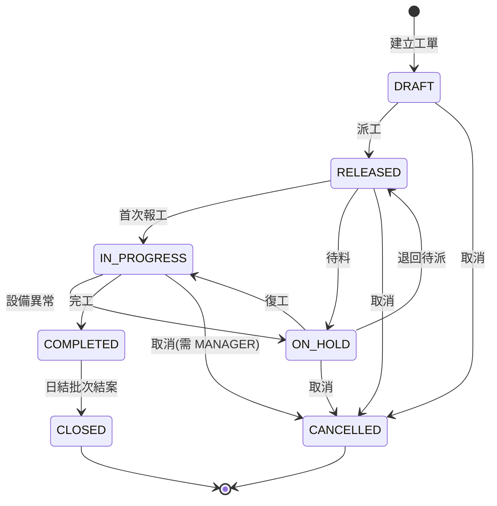

# 架構說明

## 一、系統定位

模擬製造現場的工單生命週期：**建立工單 → 派工 → 現場報工 → 依 BOM 扣料 → 完工 → 日結**。

系統邊界刻意收斂在「工單 + 報工 + 物料扣帳 + 報表」這四件事。不做採購、不做出貨、不做財務，因為那些會把專案稀釋成一堆淺薄的 CRUD。這裡的技術重點只有一個：**在併發與異常下，庫存和產出數字不能錯**。

## 二、技術選型與授權

全部為開源免費，無任何需付費的 API 或工具。

| 層級 | 技術 | 授權 | 選它的理由 |
|---|---|---|---|
| 語言 | Java 17 (Temurin/OpenJDK) | GPLv2+CE | LTS，傳產與 SI 廠主流；避開 Oracle JDK 的商用授權爭議 |
| 框架 | Spring Boot 3.3.5 | Apache 2.0 | 台灣 Java 職缺事實標準 |
| 持久層 | Spring Data JPA / Hibernate | Apache 2.0 / LGPL | 主流；同時保留原生 SQL 出口寫報表 |
| 資料庫 | PostgreSQL 16 | PostgreSQL License | 免費且支援窗口函數，報表寫得漂亮 |
| 開發用 DB | H2 | MPL 2.0 / EPL | 無 Docker 環境也能一行啟動 |
| Schema 版控 | Flyway Community | Apache 2.0 | 傳產系統改表是常態，版控是基本功 |
| 認證 | Spring Security + jjwt | Apache 2.0 | 無狀態 JWT，不依賴外部 IdP |
| API 文件 | springdoc-openapi (Swagger UI) | Apache 2.0 | 本機自架，不連任何雲端服務 |
| 測試 | JUnit 5 + AssertJ + Testcontainers | EPL / Apache 2.0 | 整合測試打真的 PostgreSQL，不是 H2 假裝 |
| 建置 | Maven + Maven Wrapper | Apache 2.0 | 附 wrapper，對方不必先裝 Maven |
| 容器 | Docker Compose | Apache 2.0 | 個人使用免費 |

> 刻意排除：任何雲端 SaaS、付費 APM、商用 IDE 授權、需金鑰的第三方 API。專案離線可跑。

## 三、分層架構

採 **by-feature（依功能切分）**，而不是傳統的 controller/service/repository 三大資料夾。理由是傳產系統活得久、改需求頻繁，功能內聚讓「加一個品檢關卡」只動一個資料夾。

```
com.example.mes
├── MesApplication.java
│
├── common/                         跨功能共用
│   ├── exception/                  BusinessException、GlobalExceptionHandler
│   ├── response/                   ApiResponse、PageResponse 統一回應格式
│   └── audit/                      BaseEntity（建立/修改人與時間）
│
├── security/                       認證授權
│   ├── SecurityConfig.java         過濾鏈、角色對應 URL
│   ├── JwtTokenProvider.java       簽發與驗證
│   ├── JwtAuthenticationFilter.java
│   └── user/                       User entity、Role enum、UserDetailsService
│
├── workorder/                      【聚合根】工單
│   ├── domain/
│   │   ├── WorkOrder.java          entity，內含狀態轉換行為
│   │   ├── WorkOrderStatus.java    狀態 enum
│   │   └── WorkOrderTransition.java 狀態機規則表（12 條合法轉換）
│   ├── repository/
│   ├── service/                    交易邊界在這一層
│   └── web/                        Controller + DTO
│
├── production/                     報工
│   ├── domain/ProductionReport.java
│   ├── repository/
│   ├── service/ProductionReportService.java   ★ 核心交易
│   └── web/
│
├── material/                       物料與庫存
│   ├── domain/                     Material、Inventory、BomItem、MaterialTransaction
│   ├── repository/
│   ├── service/InventoryService.java          ★ 扣帳與樂觀鎖
│   └── web/
│
├── report/                         報表（原生 SQL）
│   ├── repository/ReportQueryRepository.java  ★ 手寫 SQL
│   ├── dto/
│   └── web/
│
└── batch/                          日結批次
    ├── DailySettlementJob.java     @Scheduled 觸發
    └── DailySettlementService.java
```

### 各層職責邊界

| 層 | 可以做 | 不可以做 |
|---|---|---|
| `web`（Controller） | 參數驗證、DTO 轉換、HTTP 狀態碼 | 不碰 Repository、不開交易、不寫商業規則 |
| `service` | 開交易（`@Transactional`）、編排領域物件、跨聚合協調 | 不回傳 Entity 給外層（一律轉 DTO） |
| `domain`（Entity） | 自己的狀態轉換與不變條件（invariant） | 不注入 Repository、不知道 HTTP |
| `repository` | 資料存取、原生 SQL | 不寫商業判斷 |

**關鍵原則：狀態合法性由 Entity 自己守。** `workOrder.start()` 內部就會擋掉非法轉換，Service 不需要記得先檢查——忘記檢查也不會出錯，這是防呆而不是紀律。

## 四、資料模型

```
User ──< ProductionReport >── WorkOrder
                │                  │
                │                  └─ productCode ──< BomItem >── Material
                │                                                     │
                └──< MaterialTransaction >───────────────── Inventory ┘

DailyProductionSummary（日結批次產出，無外鍵，供報表快查）
```

| 表 | 用途 | 併發控制 |
|---|---|---|
| `work_order` | 工單主檔 | `@Version` 樂觀鎖（產出數量累加） |
| `production_report` | 報工明細 | `idempotency_key` UNIQUE（防重複提交） |
| `material` | 物料主檔 | — |
| `bom_item` | 用料表（每單位成品耗用量） | — |
| `inventory` | 庫存（物料 × 倉別） | `@Version` 樂觀鎖 |
| `material_transaction` | 物料異動流水（只增不改） | — |
| `daily_production_summary` | 日結彙總 | `(summary_date, line_code)` UNIQUE |
| `app_user` | 使用者 | — |

## 五、核心交易設計：一次報工發生什麼事

這是整個專案最值得講的部分。

```
POST /api/v1/production-reports
   ↓
ProductionReportService.submit()   ← @Transactional 邊界從這裡開始
   │
   ├─ 1. 以 idempotencyKey 查既有報工 → 命中就直接回傳，不重複執行
   │
   ├─ 2. 悲觀鎖載入工單（SELECT ... FOR UPDATE）
   │      理由見下方「為什麼工單用悲觀鎖」
   │
   ├─ 3. workOrder.reportProduction(good, defect)
   │      Entity 內部檢查：狀態是否允許報工、累計產出是否超過計畫量
   │      RELEASED 狀態時自動轉 IN_PROGRESS（首次報工即開工）
   │
   ├─ 4. 依 BOM 展開應扣物料 = 良品數 × 每單位用量
   │      InventoryService.consume() 逐項扣帳
   │      庫存不足 → throw InsufficientInventoryException
   │
   ├─ 5. 寫入 material_transaction 流水（可追溯每一次扣料的來源報工單）
   │
   └─ 6. 寫入 production_report
        ↓
   交易提交；任何一步拋例外 → 全部 rollback，不留半筆髒資料
```

### 為什麼工單用悲觀鎖、庫存用樂觀鎖

不是隨便選的，這題面試會追問：

- **工單**：同一張工單同時被兩個作業員報工是**高機率**事件（同一產線輪班交接）。樂觀鎖會頻繁衝突重試，不如直接 `PESSIMISTIC_WRITE` 排隊，一次做完。鎖的持有時間短（單筆交易內），不會拖垮系統。
- **庫存**：同一物料被不同工單搶用是**低機率**事件（物料種類多、分散）。用樂觀鎖避免熱點行變成全系統瓶頸，衝突時重試成本低。

### 三層防重複扣料

1. **應用層**：`idempotencyKey` 先查一次（快樂路徑，不耗鎖）
2. **資料庫層**：`idempotency_key` UNIQUE 約束（真正的最後防線，多節點部署也擋得住）
3. **交易層**：扣帳與寫報工在同一交易，任一失敗全數回滾

第 2 層是重點——**應用層檢查在多台機器同時跑時是會漏的，只有 DB 約束不會**。

## 六、狀態機

7 個狀態、12 條合法轉換，規則集中在 `WorkOrderTransition`，其餘程式碼一律透過它判斷。



要加「品檢」關卡時，改動範圍是：`WorkOrderStatus` 加一個列舉值、`WorkOrderTransition` 改規則表、加一支 API。Service 與 Controller 的既有邏輯不用動。

## 七、權限模型

| 角色 | 權限 |
|---|---|
| `OPERATOR`（現場作業員） | 查自己產線的工單、提交報工 |
| `LEADER`（線長） | + 建立工單、派工、暫停/復工、完工 |
| `MANAGER`（廠務主管） | + 取消工單、查全廠報表、手動觸發日結 |

以 `@PreAuthorize` 標在 Service 方法上，而非只擋 URL——URL 規則容易在改路由時漏掉。

## 八、報表與批次

**報表**：稼動率、不良率、物料耗用排行三支，一律手寫原生 SQL（`JOIN` + `GROUP BY` + 窗口函數），不用 JPA 自動產生。傳產的報表需求複雜且效能敏感，這是真實工作的樣子。

**日結批次**：每日 02:00 由 `@Scheduled` 觸發，彙總前一日報工資料寫入 `daily_production_summary`，並將 `COMPLETED` 工單推進為 `CLOSED`。批次具冪等性——同一天重跑不會產生重複資料（以 `(summary_date, line_code)` UNIQUE + upsert 保證）。

## 九、測試策略

| 類型 | 範圍 | 工具 |
|---|---|---|
| 單元測試 | 狀態機 12 條轉換規則、BOM 展開計算 | JUnit 5 + AssertJ |
| 整合測試 | 報工完整交易、庫存不足回滾 | Testcontainers（真 PostgreSQL） |
| 併發測試 | 多執行緒同時報工，驗證庫存只扣一次 | `ExecutorService` + Testcontainers |
| Web 層測試 | 權限攔截、參數驗證 | MockMvc + spring-security-test |

**併發測試是這個專案的招牌**：起 10 條執行緒對同一張工單送出相同 `idempotencyKey` 的報工請求，斷言最終只有 1 筆報工紀錄、庫存只扣 1 次。這個測試會抓出所有偷懶的實作。

## 十、部署與執行

```bash
# 完整版：PostgreSQL + 應用程式
docker compose up -d

# 輕量版：無 Docker，用記憶體資料庫
./mvnw spring-boot:run -Dspring-boot.run.profiles=h2
```

Swagger UI: `http://localhost:8080/swagger-ui.html`
健康檢查: `http://localhost:8080/actuator/health`
